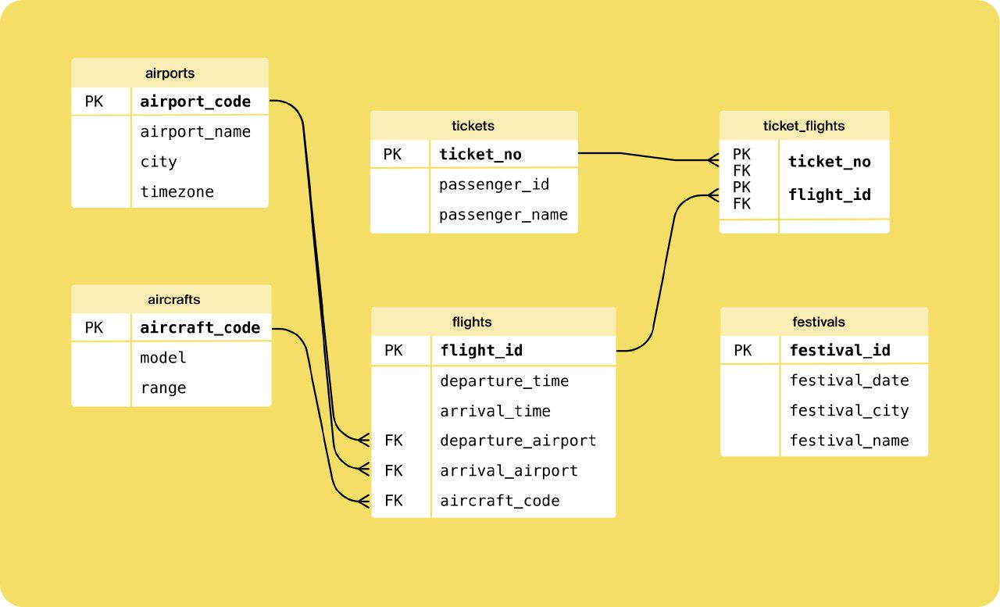

# Спрос на рейсы авиакомпании

## Описание
Данный проект анализирует спрос на рейсы авиакомпании F9, выполняющей внутренние пассажирские перевозки в России. Исследуются взаимосвязи между продажами билетов и проведением крупных фестивалей.

## Использованные инструменты и библиотеки
- **Python**
- **Pandas** 
- **Requests** 
- **BeautifulSoup** 
- **SQLAlchemy** 
- **Matplotlib**
- **Seaborn** 
- **IPython**
- **Jupyter Notebook**

## Описание данных
База данных об авиаперевозках состоит из нескольких таблиц:

- **Таблица airports** — информация об аэропортах:
  - `airport_code`: трёхбуквенный код аэропорта
  - `airport_name`: название аэропорта
  - `city`: город
  - `timezone`: часовой пояс

- **Таблица aircrafts** — информация о самолётах:
  - `aircraft_code`: код модели самолёта
  - `model`: модель самолёта
  - `range`: дальность полётов

- **Таблица tickets** — информация о билетах:
  - `ticket_no`: уникальный номер билета
  - `passenger_id`: уникальный идентификатор пассажира
  - `passenger_name`: имя и фамилия пассажира

- **Таблица flights** — информация о рейсах:
  - `flight_id`: уникальный идентификатор рейса
  - `departure_airport`: аэропорт вылета
  - `departure_time`: дата и время вылета
  - `arrival_airport`: аэропорт прилёта
  - `arrival_time`: дата и время прилёта
  - `aircraft_code`: уникальный идентификатор самолёта

- **Таблица ticket_flights** — стыковая таблица «рейсы-билеты»:
  - `ticket_no`: номер билета
  - `flight_id`: уникальный идентификатор рейса

- **Таблица festivals** — информация о фестивалях:
  - `festival_id`: уникальный номер фестиваля
  - `festival_date`: дата проведения фестиваля
  - `festival_city`: город проведения фестиваля
  - `festival_name`: название фестиваля

## Схема таблиц

